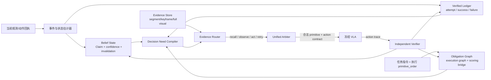

# 具身智能 Harness 新架构：BOLT-Harness

## 0. 文档边界

用户请求是“设计一套新的、高创新性且高性能的架构”。`MEMORY_LINEAGE.md` 被当作项目背景、已有实验和失败证据；其中的设计文档描述不被当作已验证结果。特别是 PMH_new 中的 VOI、Claim 失效条件和独立验证，目前应视为待验证假设。

## 0.1 研究核查结论

上一版 BOLT 的方向正确，但有两处需要修正：第一，“异步上下文 + 执行反馈 + Harness”本身已经被近期工作覆盖，不能单独作为新颖性主张；第二，纯符号 Claim/义务图不足以解决真实机器人最后一米的几何和时序问题。

本次核查重点使用了以下公开论文。2026 年论文均是截至 2026-09-29 的 arXiv 预印本，结果需要独立复现：

| 研究 | 关键证据 | 对 BOLT 的影响 |
|---|---|---|
| RT-2、OpenVLA、\(\pi_0\)、Open X-Embodiment | VLA 的语义泛化依赖大规模视觉语言和机器人数据；\(\pi_0\) 使用 flow matching 生成连续动作 | Harness 应该保护并利用冻结 VLA 的动作先验，避免让慢规划器承担低层控制 |
| Inner Monologue | 环境反馈、成功检测和场景描述组成闭环语言反馈 | 必须把执行反馈放进控制环，不能只做一次性规划 |
| ReKep | VLM 生成时空关系关键点约束，再用层级优化产生实时末端动作 | 仅有离散 obligation graph 不能解决 t19 的物理瓶颈，应增加几何约束接口 |
| V-JEPA 2 | 自监督视频表征加少量机器人数据即可形成潜在动作条件世界模型，并用于图像目标规划 | 世界模型适合做候选动作的短视预测和歧义裁决，不应默认每步大规模 imagination |
| PRISM / ReMemBench | 门控注意力和分层压缩的短期记忆能降低历史噪声，并在长程任务上优于无记忆策略 | Claim 账本之外需要一个可学习的局部时序记忆通道 |
| PonderPounce | 独立 System 2 上下文引擎异步刷新，System 1 动作模型读取最新认知并显式处理认知年龄 | BOLT 必须显式记录 cognition age、action age 和 stale window |
| ReSync | 定义 commitment–evidence gap；只在有效窗口内推进世界流或动作流，冻结配对系统上提升 4.48 点 | BOLT 原来的“慢循环/快循环”描述不够，应加入同步控制器 |
| HarnessPAI | 代码作为可执行、可演化接口，跨 rollout 用反馈修订程序并蒸馏失败技能 | BOLT 的可执行 Harness 和反馈闭环不是单独新颖点，需要把贡献聚焦到记忆、同步、义务和安全的统一机制 |
| SafeVLA-Bench | 二值成功无法表达安全；RoboCasa 成功 rollout 中仍有 36–56% 违反安全条款 | 验证器必须输出 STL 风格安全指标，安全约束应进入仲裁器 |
| What Are We Actually Benchmarking in Robot Manipulation? | 许多基准存在 shortcut、统计显著性不足、过拟合和数据源依赖 | 评测协议必须增加隐藏状态、跨场景、跨 embodiment、统计检验和机制指标 |

因此修订后的名称为 **BOLT-Sync**：Belief–Obligation–Ledger–Telemetry with Clock Synchronization。

## 1. 架构命名与核心主张

建议名称：**BOLT-Sync Harness（Belief–Obligation–Ledger–Telemetry with Clock Synchronization）**。

它把异步系统建模为一个部分可观测、带执行约束和双时钟同步的控制问题。Harness 维护一个充分统计量：

\[
S_t=(b_t, G_t, L_t, E_t, q_t)
\]

- `b_t`：对象、容器、计数和空间关系的概率信念；
- `G_t`：基于**执行划分**的义务图；
- `L_t`：动作尝试、成功验证和失败原因组成的单调账本；
- `E_t`：带来源、时间、失效条件的证据；
- `q_t`：当前动作队列、重试预算和异步同步状态；
- `c_t`：慢系统认知缓存及其 age、支持证据窗口和 commitment–evidence gap。

慢系统负责提出目标和候选动作，快系统执行动作块，Harness 负责同步两套时钟、把候选动作投影到当前可执行集合，并决定下一步应该“行动、回忆、观察、重试还是恢复”。因此记忆不是外挂 prompt，而是控制器状态的一部分。

## 2. 总体结构



## 2.1 BOLT-Sync 的四个新增层

### 双时钟同步层

在当前系统中，VLM 每 5 个动作块才更新一次，VLA 已经在执行时，慢系统的状态可能已经过期。新增同步状态：

```text
cognition_age       = now - last_planner_update
action_age          = now - action_contract_creation
evidence_age        = now - newest_supporting_observation
commitment_gap      = action_age - evidence_age
supported_window    = [lower_gap, upper_gap]
```

当 gap 处于窗口内，继续执行当前 action chunk；gap 太大时暂停提交新动作并刷新最小证据；gap 过小但世界证据仍未收敛时，推进世界/观察流而不是盲目增加候选动作。这一层直接吸收 ReSync 的 commitment–evidence gap 思路，并适配你们的“快 VLA / 慢 VLM”运行时。

### 混合记忆层

BOLT 原来的 Claim 账本适合精确事实，但不适合连续运动和短期视觉关联。记忆改为三条并行通道：

1. **符号账本**：计数、已完成集合、前置条件、失败原因和评分映射；
2. **可学习短期记忆**：PRISM 风格的门控局部 token 和分层压缩 token，保留最近几十秒的运动/接触上下文；
3. **事件证据库**：事件卡片、关键帧和完整视频，支持按 Decision Need 检索。

关键事实由符号账本决定，连续控制由短期 token 和当前观测决定，长历史只按需检索。这样不会让一个文本 Claim 强行承担所有视觉记忆职责。

### 几何约束层

对每个可执行 primitive，Planner 可以产生 ReKep 风格的关系关键点约束：

```yaml
constraint:
  - distance(gripper, tomato_sauce) < eps
  - inside(tomato_sauce, cabinet2)
  - avoid(contact, cabinet_door)
  - maintain_orientation(cup, upright)
solver: hierarchy_mpc | vla_action_projection
```

有末端位姿/深度接口时，使用层级优化或 MPC 产生短轨迹；只有 RGB 和文本接口时，把约束降级为动作 contract 的前置条件和验证条件。该层的目标是处理 t19 暴露的物理执行瓶颈，不能靠增加文本 prompt 替代。

### 安全语义层

任务完成和安全约束分别记账。每个 episode 同时输出：

```text
task_success
safe_success
SBU = success but unsafe
VSI = violation severity index
```

安全规则用 Signal Temporal Logic 表示，例如“抓取期间不能发生自碰撞”“放置后目标物在容器内持续 0.5 秒”。仲裁器把安全违反当作硬拒绝或恢复触发条件，而非在任务成功后才统计。

## 3. 五个关键模块

### 3.1 Belief State：从“摘要”升级为可失效的 Claim

每个事实都用结构化 Claim 表示，而不是一段不可追溯文本：

```yaml
claim_id: c_184
predicate: inside(red_block, left_container)
value: true
status: OBSERVED | BELIEVED | COMMITTED | CONTRADICTED | STALE
confidence: 0.91
source: [segment_17, frame_238]
valid_from: t=412
invalidation: [red_block_visible_on_table, left_container_moved]
required_for: [place_red_block]
```

`BELIEVED` 只能支持低风险动作；高风险动作必须由当前观测或已验证证据支持。任何发生移动、抓取、放置、遮挡解除或失败的事件都会触发失效条件检查。这样解决 PMH 的“状态可能陈旧”和 GPM/AOM 的“把答案键硬编码进 prompt”问题。

### 3.2 Obligation Graph：执行图、评分图、物理前置条件分离

图从 `primitive_order` 构造，而不是从 scoring stages 构造。每个执行节点包含：

```text
primitive, object, target, preconditions, settles_with, verifies_stage,
success_observation, recovery_edges, risk_level
```

评分阶段只通过 `verifies_stage` 作为评测映射存在。`pick → place` 使用“尝试过即可满足”的软依赖；`pour_1 → pour_2`、`place_i → place_{i+1}` 使用已验证成功的硬依赖。图允许分支和恢复，但不允许跳过前置节点。

定义图势函数：

\[
\Phi(G_t)=\sum_i w_i(1-\mathbf{1}[node_i=SETTLED])+
\lambda\sum_i\mathbf{1}[node_i=FAILED].
\]

一次动作只有在满足前置条件、且预期使 `Φ` 下降或显著降低失败风险时才进入执行队列。这样把 AOM 的可达性扩展为可验证的进度约束。

### 3.3 Evidence Store 与 Evidence Router：以决策需求驱动，而非让模型自省

证据分成三层：短期帧、事件卡片、完整视觉归档。检索键不是自然语言“请回忆”，而是由 `Decision Need Compiler` 生成的结构化查询：

```json
{
  "goal": "select_empty_drawer",
  "unknowns": ["drawer_1_contents", "drawer_2_contents", "drawer_3_contents"],
  "required_predicate": "empty(drawer_i)",
  "risk": "high",
  "minimum_evidence": "keyframe_or_current_view"
}
```

Router 在四种来源中选择：

1. 读当前 Claim；
2. 检索历史事件/关键帧；
3. 请求物理观察；
4. 直接行动并在动作后验证。

使用决策效用而不是抽象的“模型自觉”：

\[
U(m)=\mathbb{E}[\Delta\Phi\mid m]-
\lambda_r Risk(m)-\lambda_l Latency(m)-\lambda_c ContextCost(m).
\]

只有当 `U(recall)` 或 `U(observe)` 高于 `U(act)` 时才占用额外上下文或物理动作。检索预算有安全下限：若证据通道连续饥饿且当前义务未推进，Router 自动发射一次最小充分证据请求；若只是动作失败，则走恢复路径，不重复灌入历史。

### 3.4 Unified Arbiter：一条仲裁法覆盖记忆、动作、同步和安全

Planner 输出结构化候选：

```yaml
primitive: place
object: tomato_sauce
target: cabinet2
preconditions: [held(tomato_sauce), open(cabinet2)]
predicted_transition: inside(tomato_sauce, cabinet2)
success_observation: object_no_longer_in_gripper_and_inside_target
abort_conditions: [collision, object_dropped, no_progress]
recovery: [regrasp, reopen_target, inspect_last_segment]
```

Arbiter 对候选动作做六层检查：

1. **图合法性**：是否是当前可达义务的 primitive；
2. **Claim 前置条件**：关键前置事实是否有效且达到置信度阈值；
3. **双时钟一致性**：commitment–evidence gap 是否位于 supported window；
4. **几何可执行性**：关键点约束、抓取状态和动作队列是否可满足；
5. **安全时序约束**：是否违反 STL safety predicates；
6. **进度与风险**：是否降低 `Φ`，是否会重复已失败模式。

拒绝时返回当前 ACTIVE 义务的最小纠正动作，避免 AOM 产生空操作。对计数任务，`count:place`、`count:pour`、`count:verified_success` 由账本计算，永远不从 VLM 自述中读取。

### 3.5 Predict–Verify–Repair：把“VLA 停止”与“动作成功”分开

每个动作都有预测转移和独立验证器。验证器可以组合：当前图像变化、末端执行器状态、对象位置、容器状态和动作轨迹。结果只有三类：

- `VERIFIED`：结算节点、更新 Claim、继续；
- `FAILED`：记录失败原因、降低相关 Claim 置信度、进入恢复边；
- `AMBIGUOUS`：增加最小证据或观察，不结算。

这一步直接针对 t22 的“规划文本正确但物理执行没有推进”，并避免 `SEEN = VERIFIED` 的错误提交。

## 4. 异步运行时

### 快循环（每个动作块）

```text
observe → update Claims/Ledger → verify previous action
       → advance obligation graph
       → arbitrate queued primitive
       → send bounded action block to frozen VLA
```

### 慢循环（每 `VLM_INTERVAL`）

```text
compile Decision Need → retrieve minimal context
       → VLM proposes candidate action contract
       → Arbiter accepts / rewrites / requests evidence
```

事件提交由 Harness 的变化检测触发；VLM Consolidator 只负责一次性的事件结构化，不拥有自己的 planner 状态。这样保留 PMH 的职责分离，同时把读路径从“模型主动自省”改成“结构化缺口自动编译”。

## 5. 理论创新点

### 5.1 Belief–Obligation Duality

大多数 memory harness 只表示“知道什么”，大多数 planner 只表示“下一步做什么”。BOLT 同时维护两种状态：

\[
\text{belief feasibility} \cap \text{obligation reachability}
\]

动作只有同时满足事实信念和图可达性才合法。遮挡任务由 belief/evidence 驱动，计数任务由 ledger/derived 驱动，搬运任务由 execution graph 和几何约束驱动；三者不再靠任务名或 prompt 特判连接。这个组合仍需通过消融证明，不能仅凭形式定义宣称有效。

### 5.2 Evidence Conservation Law

高风险 Claim 必须存在可回溯 evidence pointer，且只能在其 validity condition 未被触发时使用。所有 Claim 更新必须产生 `add / strengthen / invalidate / contradict` 事件。该约束使“记忆有效”可以通过 coverage、staleness、unsupported-use 计数检验，而不是只看最终分数。

### 5.3 Commitment–Evidence Safety Window

动作提交不只取决于“当前动作是否合法”，还取决于动作承诺和支持证据是否同步。令

\[
g_t = age(action\_contract_t)-age(newest\_supporting\_evidence_t).
\]

只有当 \(g_t\in[g_{min},g_{max}]\) 时，系统才允许继续发出新的长动作块；超出上界时刷新证据，低于下界但世界流仍不确定时推进观测。该规则将 ReSync 的双时钟发现纳入 Harness，并提供可测的同步变量。

### 5.4 Monotone Verified Progress

只有验证成功才能使义务节点 `SETTLED`，因此 `Φ(G_t)` 不能因为语言输出而下降。重试可以改变动作策略，但不能重复结算或跳过前置节点。在验证器 sound、恢复边有限、每次重试有正概率成功的条件下，系统具有有限期望完成时间；这是需要在仿真和真实任务上验证的理论假设，不是当前实验已经证明的结果。

### 5.5 Decision-Centric Memory Complexity

上下文复杂度从“历史长度”变为“当前决策的不确定性”：

\[
O(|\text{active unknowns}|+|\text{active obligations}|+|\text{recent failures}|),
\]

而不是 `O(all past frames)`。这给出比固定窗口、固定推送和无条件检索更明确的扩展性目标。

## 6. 与已有设计的关系

| 已有设计 | BOLT 吸收的部分 | BOLT 修正的部分 |
|---|---|---|
| PMH | State/Evidence 分离、Claim 来源、coarse-to-fine | 不要求 VLM 自己意识到缺口；缺口由行为和图状态编译 |
| pull/push | 最小推送、事件索引 | 不让枚举工具占用往返；按 Decision Need 查询 |
| GPM | stall/attempt/attractor 门控、默认流利 | 证据门控与动作门控共用一个 Arbiter；不靠模式表 |
| AOM | obligation graph、derived count、纠正性改写 | 从 execution graph 构图；加入验证器、失败恢复和 Claim 失效 |
| PIC-MEM | 证据通道与动作通道的统一需求 | 只保留一个账本、一个调度器、一个上下文拼装器 |

## 7. 实施优先级

**Phase 1：确定性核心与双时钟（1–2 周）**

- 从 `primitive_order` 构造 execution graph；
- 实现 `Verified Ledger`、`count:*` 和 scoring bridge；
- 把现有 AOM gate 改成统一 Arbiter；
- 增加 `attempt / verified / ambiguous / gate_reject / recovery` telemetry；
- 加入 `cognition_age / action_age / evidence_age / commitment_gap`，做 ReSync 风格同步消融。

**Phase 2：混合记忆与最小证据路由（2–3 周）**

- Claim schema 和失效条件；
- Decision Need Compiler；
- 自动 keyframe retrieval；
- evidence starvation safety floor；
- 先做规则 Router，再做 learned Router。
- 增加门控局部 token 和分层短期 token，比较 Claim-only、PRISM-style、混合记忆。

**Phase 3：几何约束、独立验证与恢复（2–3 周）**

- action contract parser；
- 视觉状态变化验证；
- drop/collision/misalignment 分类；
- bounded recovery graph；
- 与 t19 的第二段搬运失败回放联调。
- 如果接口允许，接入 ReKep 风格关键点约束和层级优化；否则先实现 contract-level geometry checks。

**Phase 4：安全和世界模型（2–4 周）**

- STL 安全规则、SBU、VSI；
- 用 V-JEPA 2-AC 类 latent predictor 做候选动作的短视预测；
- 只在 `commitment_gap` 支持窗口内启用 imagination，测量额外延迟和真实收益。

**Phase 5：学习化组件**

- 用历史轨迹训练 event boundary detector；
- 用失败回放训练 evidence relevance / risk predictor；
- 用 offline bandit 或 constrained RL 学习 `U(m)` 的权重；
- 保持 graph legality、ledger settlement 和高风险验证规则为硬约束。

## 8. 必做消融与指标

不能只报告宏平均 stage score。每个臂必须同时报告：

- `coverage`: 实际发射的 recall、observe、verify、recovery 比例；
- `unsupported_claim_use`、`stale_claim_use`；
- `n_actual / n_perceptual / n_derived`；
- `gate_reject / dep_reject / offgraph / rewrite`；
- `verified_success / ambiguous / physical_failure`；
- 每个义务的 settlement time 和 `Φ` 曲线；
- token、VLM 调用次数、额外物理动作数；
- 同种子、同臂、足够 trial 数的置信区间。

最小消融矩阵：

1. BOLT-full；
2. 去掉 evidence router；
3. 去掉 execution graph；
4. 去掉 derived ledger；
5. 去掉独立 verifier；
6. 去掉 safety floor；
7. rule router 与 learned router 对比。

评测必须先用 deterministic replay 验证 `Φ` 单调性、图前置条件、早停门限、双时钟窗口和计数器，再做 GPU 实验。单种子结果不得与多种子宏平均比较；任何早停必须在同种子对照轨迹上校准。按照近期基准审计的建议，还要增加：

- 隐藏状态和遮挡布局的随机化，防止 shortcut；
- 未见物体、未见场景和至少一个未见 embodiment；
- 多种子置信区间、效应量和预注册的主要指标；
- 任务成功与安全成功分开报告；
- 机制指标与最终分数同时发布，避免把“通道发射”误读成“能力提升”。

## 9. 可检验的研究假设

1. 在 t5 上，`Decision Need → keyframe retrieval → Claim` 将减少无关检索，并保持遮挡信息恢复能力；
2. 在 t8/t22 上，`count:verified_success` 比 prompt 计数更稳定，且能区分“正确规划但动作失败”；
3. 在 t19 上，execution graph 能消除错误的 place-first 命令，但最终收益取决于 verifier/recovery 和几何约束，而不是 primitive 配比；
4. 在异步任务上，commitment–evidence window 能降低 stale action 和无效重规划；
5. PRISM-style short-term token 对连续运动有帮助，但 Claim-only 对精确计数更可靠；混合记忆应优于任一单通道；
6. 在 26 任务上，BOLT 的主要收益应先体现在机制指标和失败分类，再体现在分数；
7. learned Router 只有在 rule Router 已经证明通道真正发射后才值得训练。

## 10. 第一版接口

```python
state = harness.observe(obs, action_trace)
need = harness.compile_decision_need(state)
proposal = planner.plan(task, need, harness.context(need))
decision = harness.arbitrate(proposal, state)
trace = executor.run(decision.action)
result = harness.verify(trace, decision.contract)
harness.commit(result)
```

最小可行版本不需要训练新 VLA，也不需要第二个 autonomous agent。它可以在现有 Harness、冻结 pi05 和外部 VLM 规划器上实现；短期记忆、几何约束和世界模型先作为可关闭模块。每个新增机制都有独立计数器和可关闭开关。

## 11. 研究引用

- RT-2: [arXiv:2307.15818](https://arxiv.org/abs/2307.15818)
- OpenVLA: [arXiv:2406.09246](https://arxiv.org/abs/2406.09246)
- \(\pi_0\): [arXiv:2410.24164](https://arxiv.org/abs/2410.24164)
- Open X-Embodiment: [arXiv:2310.08864](https://arxiv.org/abs/2310.08864)
- Inner Monologue: [arXiv:2207.05608](https://arxiv.org/abs/2207.05608)
- ReKep: [arXiv:2409.01652](https://arxiv.org/abs/2409.01652)
- V-JEPA 2: [arXiv:2506.09985](https://arxiv.org/abs/2506.09985)
- PRISM / ReMemBench: [arXiv:2606.16178](https://arxiv.org/abs/2606.16178)
- PonderPounce: [arXiv:2608.24115](https://arxiv.org/abs/2608.24115)
- ReSync: [arXiv:2609.33944](https://arxiv.org/abs/2609.33944)
- HarnessPAI: [arXiv:2609.29166](https://arxiv.org/abs/2609.29166)
- SafeVLA-Bench: [arXiv:2606.00773](https://arxiv.org/abs/2606.00773)
- Benchmark audit: [arXiv:2606.04233](https://arxiv.org/abs/2606.04233)
